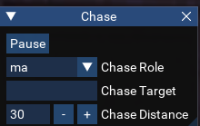
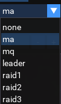

# luachase

A script for chasing using MQ2Nav

 

# Description

This script allows to choose from a number of options for who to follow, as well as allowing to just specify a PC name of the target to chase. Chasing uses MQ2Nav and so requires a valid mesh for the current zone.

# Installation

Place the script in your MQ  Lua folder.

# Usage

Start the script with `/lua run chase`.
